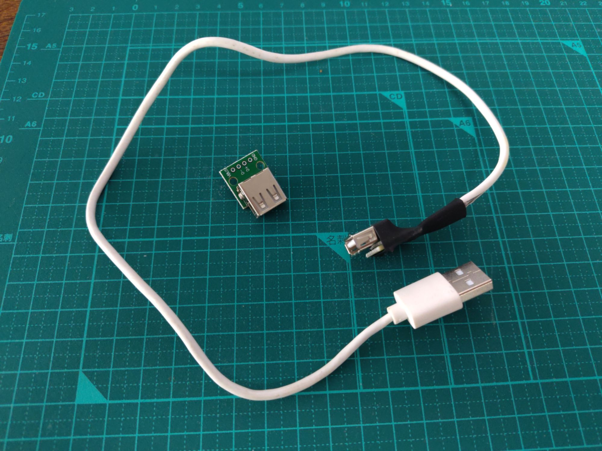

# Hi-MD Dream Drive

**Driver para Nextor para poder utilizar unidades ópticas en un MSX, como un MiniDisc Hi-MD,  CD o DVD.**

Hi-MD Dream Drive es un firmware para el cartucho USB **Rookie Drive NX** (chip CH376) que permite a un MSX leer, escribir y **arrancar** desde reproductores de MiniDisc Hi-MD (los que llevan conector USB), CD o DVD conectados por USB. Son tres piezas: un driver para Nextor, un cargador de arranque propio y una herramienta de recuperación dentro de la ROM que permite actualizar el firmware desde un pendrive.

El MiniDisc **sigue siendo un disco Sony normal**: el mismo disco se usa en el walkman, en el Mac (o el PC) y en el MSX, sin convertir nada.

**[IMPORTANTE!!] Leer la sección sobre qué cable utilizar para conectar los lectores de CD-DVD. Usar el driver y los lectores bajo tu propio riesgo.**

Este es un proyecto realizado con la ayuda de Claude Code.

*English version: [README.md](README.md).*

---

## Qué hace

- **MiniDisc Hi-MD como disco del MSX, compartido con el walkman y el ordenador.** Se formatea el disco en el walkman, se copian ficheros desde el Mac o el PC a través del walkman, se conecta el walkman al MSX y los ficheros están ahí. El MSX lee y escribe en el disco sin romper el formato de Sony: después el walkman y el Mac lo siguen aceptando.
  - El Hi-MD usa sectores de 2048 bytes y Nextor espera sectores de 512. El driver hace la traducción.
  - El sector de arranque del disco (el que necesitan el walkman y el Mac) está protegido: el MSX nunca lo escribe, salvo al formatear.
- **CD y DVD por USB, de solo lectura**, de dos tipos:
  - **Discos con FAT** (grabados a propósito con el mismo formato que el MiniDisc).
  - **Discos ISO9660 normales** (los de toda la vida: un CD de datos cualquiera, o un CD/DVD grabado en el PC). El driver los presenta a Nextor como un disco FAT de solo lectura que fabrica sobre la marcha a partir del disco. No hace falta preparar nada en el disco.
- **Arranque de MSX-DOS desde el MiniDisc, el CD o el DVD**: si el disco tiene `NEXTOR.SYS` y `COMMAND2.COM`, el MSX arranca en MSX-DOS desde él; si no, arranca en BASIC.
- **Órdenes de BASIC `CALL DREAM`** (ver más abajo todas las ordenes): información del disco, expulsión segura, formateo compatible con el walkman y un registro de diagnóstico.
- **Modo de emulación de disco de Nextor (`EMUFILE`)**: juegos en imagen de disquete (`.DSK`) arrancan desde el MiniDisc.
- **Firmware 100 % propio y auto-actualizable**: cargador de arranque y recuperación escritos desde cero; para actualizar basta un pendrive y CTRL+R al encender.

---

## Hitos

- **2026-07-08**: el MSX arranca MSX-DOS desde un MiniDisc. Fecha histórica: es la primera vez, que sepamos, que un ordenador arranca su sistema operativo desde un MiniDisc. 
- **2026-07-09**: velocidad multiplicada por 4 (lectura de 5,7 a 23,1 KB/s). Funciona la información, expulsión y formateo de disco. El walkman acepta un disco formateado por el MSX, el cambio de disco en caliente y el desenchufar y volver a enchufar el USB.
- **2026-09-22**: primer DVD en el MSX: un DVD+R grabado con FAT se monta y MSX-DOS arranca desde él.
- **2026-09-24**: primer CD ISO9660 leído (un CD de un PC, sin preparar nada) y MSX-DOS arranca desde un DVD ISO9660 grabado en un Mac.
- **2026-09-25**: `EMUFILE`: un juego en imagen de disquete arranca desde el MiniDisc.
- **2026-10-04**: driver v3.4.1, validado exhaustivamente y con corrección de numerosos bugs.

---

## Hardware

### Lo que hace falta

- **Un MSX2 o superior (probado en un MSX2+) con al menos 128 KB de RAM mapeada** (memory mapper). Es imprescindible: el driver guarda su estado y su caché en un segmento de 16 KB del mapper, y sin 128 KB de RAM mapeada Nextor arranca en modo MSX-DOS 1, donde el driver (y los discos FAT16 del Hi-MD) no funcionan. 
- **Un cartucho Rookie Drive NX** (USB con chip CH376 en los puertos de E/S 20h/21h del MSX). Otros cartuchos con CH376 en los mismos puertos deberían funcionar, pero no se han probado.
- **Una unidad USB con sectores de 2048 bytes**: un walkman Hi-MD de Sony (todos llevan conector USB) o un lector de CD/DVD USB. Ojo: los grabadores NetMD que no son Hi-MD también tienen USB, pero no sirven: no se presentan al ordenador como un disco. **Los pendrives y tarjetas (sectores de 512 bytes) no los usa este driver.**

### Lo que se ha probado

- MSX: **Sanyo PHC-70FD** (MSX2+), Omega MSX (MSX2+).
- Cartucho: **Rookie Drive NX**.
- Walkman: **Sony MZ-NH600** y **Sony MZ-RH1**, con discos **Hi-MD de 1 GB** y MiniDiscs normales formateados en modo Hi-MD (MD60 / MD74 / MD80). Otros walkman Hi-MD con USB deberían funcionar.
- Lector de CD/DVD: **"Antika" slim USB** (puente USB Initio INIC-1618L, mecánica **MATSHITA DVD-RAM UJ8B0**), alimentado aparte y conectado con un cable "solo datos" (ver la sección siguiente). Otros lectores USB de "almacenamiento masivo" normales deberían funcionar igual, pero no se han probado.
- Discos ópticos probados: DVD+R grabado con FAT, CD ISO9660 grabado en un PC, DVD ISO9660 grabado en un Mac.

---

## Alimentación del lector de CD/DVD y el cable "solo datos"

**Esto es importante: un cable mal hecho puede dañar el MSX, el cartucho o el lector.**

**El walkman Hi-MD no necesita nada**: se conecta con su cable USB normal y funciona (se alimenta por el USB).

**Un lector de CD/DVD USB, sí.** Necesita dos cosas:

1. **Su propia alimentación.** El MSX no puede alimentarlo. Un lector necesita mucha corriente, sobre todo al arrancar el motor y enfocar el disco, más de la que da un puerto USB normal, y el puerto USB del Rookie Drive la saca de la ranura de cartucho del MSX, que no está pensada para eso. Muchos lectores slim traen un **segundo cable USB solo para alimentación**; ese cable va a un cargador USB normal (nosotros usamos uno de 1,2 A).
2. **Un cable USB "solo datos"** entre el Rookie Drive y el lector: un alargador USB normal con **el hilo rojo cortado**.

### ¿Por qué hay que cortar el hilo rojo?

Un cable USB tiene cuatro hilos: dos de datos (verde y blanco), la masa (negro) y los +5 V de alimentación (rojo, "VBUS").

Cuando el lector se alimenta con su segundo cable desde un cargador, los 5 V del cargador **vuelven** por el cable de datos hacia el ordenador (lo que se llama *retroalimentación*): Hay 5 V en el hilo rojo del cable de datos. En un PC no suele pasar nada, pero aquí esa tensión entra en el cartucho y en el MSX: dos fuentes empujando en el mismo hilo. Puede estresar o dañar el cargador, el cartucho o el MSX, y el MSX puede quedar "medio encendido" aunque esté apagado.

Por eso el cable "solo datos" es obligatorio con este tipo de lectores, y recomendable con cualquiera (no tiene ningún inconveniente para el funcionamiento).

Cortando **solo el hilo rojo**, los datos y la masa siguen conectados (la masa es imprescindible: es la referencia de las señales de datos) y la alimentación de cada lado queda separada.

### ¿Mi lector retroalimenta? Prueba sencilla

Con el lector enchufado a su cargador y **sin conectarlo al MSX**, medir con un polímetro la tensión entre el pin 1 (VBUS) y el pin 4 (masa) del conector USB que va al ordenador. Si marca unos 5 V, el lector retroalimenta y el cable "solo datos" es obligatorio. En la duda, usar siempre el cable "solo datos": no tiene inconvenientes para el funcionamiento.

### Cómo hacer el cable



*Nuestro cable "solo datos", hecho con un cable USB roto y una [plaquita USB-A 2.0 hembra](https://es.aliexpress.com/item/1005006600039619.html) como la del centro de la foto (con los cuatro pines rotulados: VBUS, D-, D+, GND). Del cable se sueldan a la plaquita solo tres hilos: D-, D+ y GND; el rojo (VBUS) se deja sin conectar. El extremo ya montado es el que está bajo el termorretráctil negro.*

#### Forma sencilla
1. Un alargador USB barato (USB-A macho a USB-A hembra).
2. Pelar con cuidado un trozo de la funda exterior, a unos centímetros de un extremo.
3. Cortar **solo el hilo rojo** y aislar bien los dos extremos (cinta aislante o termorretráctil). No tocar los demás.
4. Los colores son un estándar, pero no todos los fabricantes lo respetan: si hay dudas, comprobar con un polímetro que el hilo cortado es el del **pin 1** (VBUS) del conector.
5. Marcar el cable como "SOLO DATOS" para no usarlo con otra cosa.

#### Si tienes soldador
Otra forma de hacerlo, sin alargador que cortar: un cable USB con su conector macho (vale uno roto por el otro extremo) y una plaquita USB-A hembra de este tipo. Se sueldan D-, D+ y GND a los pines rotulados y el hilo rojo se deja suelto y aislado.

---

## Instalación (flashear el firmware)

El fichero que se graba en el cartucho es **`DDFIRMWA.ROM`** (192 KB). Lleva el cargador de arranque y la recuperación en el banco 0, los bancos 1-3 libres y Nextor 2.1.4 con el driver en los bancos 4-11. Descargar la rom ya compilada de la sección Releases del repositorio.

### La primera vez (desde el firmware de fábrica del cartucho)

La recuperación de fábrica del Rookie Drive busca un fichero llamado **`RDFIRMWA.ROM`**, no `DDFIRMWA.ROM`. Así que **solo la primera vez**:

1. Copiar la ROM a la raíz de un pendrive FAT **con el nombre `RDFIRMWA.ROM`**.
2. Enchufar el pendrive al cartucho, encender el MSX con **CTRL+R** pulsado y seguir las instrucciones en pantalla. 

### Las siguientes veces (ya con Hi-MD Dream Drive en el Rookie Drive NX)

1. Copiar `DDFIRMWA.ROM` (con ese nombre) a la raíz de un pendrive FAT.
2. Enchufar el pendrive al cartucho y encender el MSX con **CTRL+R** pulsado.
3. La recuperación busca el fichero ("DDFIRMWA.ROM (192K) found and valid!"). **F1** = grabar, **ESC** = cancelar.
4. Mientras graba, sale "DO NOT POWER OFF UNTIL DONE" y una fila con los 12 bancos: `.` pendiente, `o` en curso, `O` hecho, `X` error. **No apagar hasta que diga "DONE. Power off and on again."** Entonces apagar y encender.

La recuperación graba primero Nextor (bancos 4-11) y el cargador de arranque al final, y no borra nada sin haber leído antes del pendrive lo que va a escribir. Si falla la lectura del pendrive, lo reintenta (hasta 3 veces el fichero entero) y si no puede, dice "USB read error. Retry, or try another pendrive.". Si lo que falla es el propio chip de memoria del cartucho, dice "Flash error. Power off and try again.".

### Teclas al encender

- **CTRL+R**: entrar en la recuperación (actualizar el firmware).
- **ESC**: saltarse el cartucho entero (el MSX arranca como si no estuviera).
- Con el pendrive no hace falta nada más: para usar el MSX con el walkman o el lector, se quita el pendrive y se conecta la unidad.

---

## Uso

### Encender

**Enchufar la unidad (walkman o lector) ANTES de encender el MSX.**

Al encender, sale "Hi-MD Dream Drive v.AAAAMMDD", "USB controller found!" y, debajo, los mensajes de Nextor y "MD/CD/DVD USB Driver v.3.4.1". Con un disco bueno se llega a `A:\>` (si el disco tiene MSX-DOS) o a BASIC.

- **El walkman puede estar apagado**: se enciende solo con la corriente del USB. Si tarda en estar listo, abajo sale la línea `Waiting for the disc drive... (ESC to skip)` con un contador (`07/..` bajando a `01/..`) y un circulito que se mueve. El MSX arranca solo en cuanto el disco está listo (un walkman apagado tarda menos de medio minuto). Si la unidad no llega a estar lista, el MSX deja de esperar solo (como mucho unos 3 minutos). Con el walkman ya encendido y el disco cargado, arranca enseguida.
- **ESC** durante esa línea deja de esperar y el MSX sigue arrancando (sin la unidad).
- **Sin nada enchufado**, el MSX llega a BASIC en unos 27 segundos (la línea de espera agota sus intentos), o al momento con ESC.

### Si la unidad se enchufa después de encender

Nextor reparte las letras de unidad al arrancar: si no hay unidad, no le da letra, y `FILES` dice "Bad drive name" aunque el disco ya esté. Dos opciones:

- **Reiniciar el MSX** con la unidad ya enchufada (lo más sencillo), o
- sin reiniciar: `CALL DREAM` (para que el driver vea la unidad; si dice `(no disc) [02/3A/00]` es el walkman cargando el disco: repetir `CALL DREAM` a los pocos segundos) y después **`CALL MAPDRV("A:",0,1,1)`**. Con eso, `FILES` lista el disco. El `0` (disco entero) es para los discos formateados por el Walkman o por `CALL DREAM FORMAT`; un disco con tabla de particiones (FDISK) usaría `1`.

### Cambiar de disco

- Se puede cambiar el disco (o la unidad entera) con el MSX encendido. La primera orden después del cambio da **"Disk offline" una vez** (en BASIC); la siguiente ya ve el disco nuevo. Es a propósito: así no se mezcla nada del disco anterior con el nuevo.
- En MSX-DOS sale "Not ready": contestar **A** (Abort) y repetir la orden. ("Retry" repite el "Not ready".) Tras un Abort el indicador puede salir como `A>` en vez de `A:\>`: es normal.
- Mientras el walkman carga un MiniDisc nuevo (su icono girando), `FILES` da "Disk offline"; en cuanto para, lista el disco nuevo.
- **No cambiar de MiniDisc con un fichero abierto.** Lo más seguro: `CALL DREAM EJECT` antes de sacar el disco.
- Desenchufar el USB en caliente también se puede: cada orden da "Disk offline" enseguida (sin esperas), y al volver a enchufar la unidad la siguiente orden la vuelve a usar.
- **Ojo al enchufar un walkman con el MSX encendido: el MSX se puede reiniciar.** Al conectarlo, el walkman tira de golpe de la corriente del USB (más aún si lleva batería recargable y se pone a cargarla), y esa corriente sale del propio MSX. Nos ha pasado con un MZ-RH1 con su batería: al enchufarlo en caliente, el MSX se reinició. No se estropea nada, pero se pierde lo que hubiera en memoria. Lo seguro es enchufar la unidad antes de encender.

### Formatear un MiniDisc

- **Lo recomendado: formatear en el walkman** (desde su menú). Es el formato que entienden el Walkman, el Mac y el MSX.
- **Desde el MSX: `CALL DREAM FORMAT`.** Pregunta "ALL DATA WILL BE LOST. FORMAT? (Y/N)"; con **Y** escribe el mismo formato que pone el walkman ("Format complete."). Probado en el aparato con un MiniDisc y con un Hi-MD de 1 GB: el walkman y el Mac lo aceptan. Al meterlo en el walkman, este pregunta si crear el fichero de audio: es lo esperado (el MSX no crea la parte de música; el walkman la crea él solo).
- Si el disco no tenía formato (virgen) cuando se encendió el MSX, Nextor no le dio letra: tras formatearlo, reiniciar.
- **No usar FDISK** en un MiniDisc: el disco pasa a ser solo del MSX (el walkman se queja y el Mac no lo ve).
- Los CD/DVD no se pueden formatear: "CD/DVD discs are read-only.".

### Las órdenes `CALL DREAM` (= `CALL HIMD`)

`CALL DREAM` y `CALL HIMD` son lo mismo (`HIMD` es el nombre original y se mantiene para siempre).

- **`CALL DREAM`**: información. Ejemplo con el walkman:
  ```
  Hi-MD Dream Drive
  Unit:   SONY     Hi-MD WALKMAN
  Media:  964 MB  Hi-MD 1GB
  Format: FAT16 (Walkman compatible)
  Status: spinning
  Driver: v3.4.1
  ```
  Con el lector: "Unit: MATSHITA DVD-RAM UJ8B0", "Media: 650 MB DVD+R", "Format: FAT16" o "Format: ISO9660 <etiqueta del disco>". Si algunos ficheros del CD no se pueden mostrar, añade "(partial)". Sin unidad: "(no device)"; sin disco: "(no disc) [kk/aa/qq]" (el motivo que da la unidad).
- **`CALL DREAM EJECT`**: expulsión segura. En el walkman vacía cachés y para el disco ("Disc stopped. Safe to remove."). En un lector de CD/DVD abre la bandeja ("Disc ejected.").
- **`CALL DREAM FORMAT`**: formatear (ver arriba).
- **`CALL DREAM LOG`**: enseña las últimas incidencias que ha visto el driver (códigos de error de la unidad, puestas en marcha del USB...) y las borra. Sirve para los informes de fallos: una foto de la pantalla ayuda mucho.

### Mensajes de diagnóstico

Si algo falla, el driver escribe una línea en la última fila de la pantalla (solo en modo texto), por ejemplo `HIMD E:..`, `HIMD W:..` (escritura), `HIMD DS:..` o `HIMD INIT:..`. No hace falta entenderla: **una foto de esa línea y de `CALL DREAM LOG`** es el mejor informe de fallo. 

### CD y DVD

- **Solo lectura**: `SAVE`, `COPY` hacia el disco, etc. dan "Disk write protected".
- **Discos ISO9660**: los nombres se ven en formato 8.3 (8 letras + 3 de extensión, en mayúsculas). Los nombres que no caben se acortan con `~` y un número (por ejemplo `LONG_F~6.TEX`). Solo se leen los nombres ISO básicos (Joliet y Rock Ridge se ignoran).
- **Para arrancar MSX-DOS desde un CD/DVD**, `NEXTOR.SYS` y `COMMAND2.COM` tienen que estar en la carpeta raíz del disco.
- Un DVD grabado en el Mac con `hdiutil` funciona tal cual. Para grabar una imagen: `hdiutil burn -speed 4 -forceclose <imagen>`. 

### Modo emulación de disco (`EMUFILE`)

El `EMUFILE.COM` de Nextor (probada la versión 1.3) funciona en un MiniDisc: se crea el fichero `.EMU` con una o varias imágenes `.DSK` (`EMUFILE JUEGO.EMU JUEGO.DSK`) y `EMUFILE SET JUEGO.EMU` reinicia el MSX y arranca el juego desde el MiniDisc. Probado en el aparato con el juego Quinpl. Límites:

- **El `.DSK` tiene que estar entero (no troceado) en el disco.** EMUFILE dice "Ok" aunque esté troceado, pero el juego leerá datos de otro sitio. Un `.DSK` copiado en un MiniDisc recién formateado (o en el que no se ha borrado nada antes) queda entero.
- **El modo permanente (`EMUFILE SET x P`) no se puede en un MiniDisc con formato del walkman**: escribiría en el sector de arranque del disco, que el driver protege ("Write protected disk"; no se escribe nada). En un disco con tabla de particiones sí funciona, y mantener pulsado **0** al encender lo anula.
- **No funciona CD/DVD** 

---

## Velocidad (medida en el aparato)

En el Sanyo PHC-70FD (Z80 a 3,58 MHz) con el MiniDisc:

| Operación | Velocidad |
|-----------|-----------|
| Lectura | ~23,1 KB/s |
| Copia (leer + escribir) | ~12,0 KB/s |

El límite es la CPU del MSX, no el MiniDisc.

---

## Límites conocidos

- **Enchufar un walkman con el MSX encendido puede reiniciar el MSX** (el tirón de corriente del USB sale del MSX; visto con un MZ-RH1 con batería recargable). Mejor enchufar la unidad antes de encender.
- **Si al encender no hay un disco que se pueda leer** (o se pulsa ESC en la línea de espera), Nextor no deja letra de unidad para él ("Bad drive name"). Solución: `CALL MAPDRV` (ver "Si la unidad se enchufa después de encender") o reiniciar con un disco bueno.
- **Discos rayados**: si el lector no puede usar el disco (no lo enfoca), el driver lo dice enseguida ("Not ready", línea `HIMD DS:04`) en vez de esperar. Contestar A (Abort) y cambiar de disco. Un error de lectura a mitad de un fichero en un disco real no se ha podido probar todavía (los discos rayados disponibles no llegaban a montar).
- **Dos MiniDiscs formateados por el walkman son casi idénticos para MSX-DOS** (el walkman les pone a todos el mismo número de serie). El walkman avisa al cambiar de disco y el driver lo detecta, pero la regla es: no cambiar de disco con un fichero abierto.
- **UNDEL (recuperar ficheros borrados) no funciona en un MiniDisc con formato del walkman.** Al borrar, MSX-DOS quiere marcar el disco en su sector de arranque, que el driver protege; el driver guarda esa marca en su memoria en vez de en el disco. Consecuencias: (1) no hay UNDEL; (2) si se borra algo y se apaga sin escribir nada más, la segunda copia de la FAT del disco puede quedarse con los huecos de lo borrado marcados como ocupados (la primera copia, la que usan el walkman y el Mac, está bien; se arregla sola con la siguiente escritura en esa zona). Un "Primeros auxilios" del Mac podría avisar de que las dos copias no coinciden.
- **CD/DVD ISO9660**:
  - Solo la primera sesión del disco. Los discos solo-UDF (algunos DVD grabados en Windows) no se pueden leer.
  - Ficheros de más de 2 GB, o que no quepan en el volumen que fabrica el driver en discos enormes, no se ven (`CALL DREAM` añade "(partial)").
  - `DIR` en MSX-DOS calcula el espacio libre leyendo toda la FAT: en un DVD ISO tarda unos segundos. `FILES` de BASIC no lo nota.
  - Listar una carpeta con miles de ficheros es lento (unos 2 minutos y medio para 3000 ficheros en el emulador, casi todo es `FILES` pintando).
- **Nextor 3.0 todavía no es compatible**: el driver es para Nextor 2.x (la ROM lleva Nextor 2.1.4). Nextor 3 cambia la forma de hablar con los drivers; hará falta adaptar el driver.
- **Solo unidades con sectores de 2048 bytes** (walkman Hi-MD y lectores de CD/DVD). Pendrives y tarjetas no.
- **Lector de CD/DVD recién encendido (en frío)**: su mecánica tarda un poco en asentarse y las primeras lecturas largas pueden fallar con "no seek complete" (código 03/02/00). Desde la v3.4.1 el driver lo reintenta solo, hasta 5 veces con un segundo de pausa entre intentos y sin empezar ninguno nuevo pasados unos 40 segundos desde el primero: lo normal es que el primer `DIR` tarde unos segundos más y salga bien. Si el disco de verdad no se puede leer, el error ("Data error") sale igual, dentro de ese tope. Estos reintentos están comprobados en el emulador (con una copia del mismo DVD que fallaba); en el aparato todavía no se han visto actuar. Si aun así sale el error, basta con repetir la orden.

---

## Cómo informar de un fallo

Si algo no funciona, cuéntalo: es la única forma de arreglarlo. Los fallos se apuntan en la sección **[Issues](https://github.com/peruho/msx-hi-md-dream-drive/issues)** del repositorio en GitHub. Se puede escribir en español o en inglés.

Antes de escribir, mira la sección "Límites conocidos": puede que lo que te pasa ya esté explicado ahí.

### Lo más importante: dos fotos

No hace falta entender nada de lo que sale en pantalla. Con el móvil basta:

1. **Foto de la pantalla en el momento del fallo**, entera, que se lea el texto. Fíjate en la última fila: si el driver ha escrito una línea que empieza por `HIMD` (por ejemplo `HIMD E:FA S:03/02/00 C:14 D:00`), tiene que salir en la foto.
2. **Foto de `CALL DREAM LOG`**. Es el registro de lo último que le ha pasado al driver. Para verlo:
   - **No apagues ni reinicies el MSX** después del fallo: el registro se pierde.
   - Si estás en MSX-DOS (`A:\>`), escribe `BASIC` para pasar a BASIC.
   - Escribe `CALL DREAM LOG` y haz la foto. **Solo hay una oportunidad**: el registro se borra al enseñarlo. Si sale `(log empty)`, dilo también.

Si puedes, añade una tercera: **foto de `CALL DREAM`** (dice qué unidad y qué disco ve el driver, y la versión).

Si el MSX se queda colgado y no puedes escribir nada, haz la foto de la pantalla tal como esté y cuenta que se colgó.

### Qué contar

- **Versión**: la que sale al encender ("MD/CD/DVD USB Driver v.X.X") o en `CALL DREAM` ("Driver: vX.X").
- **Tu equipo**: modelo de MSX, cuánta memoria tiene y qué otros cartuchos hay puestos.
- **La unidad**: qué walkman o qué lector de CD/DVD (marca y modelo). Si es un lector: cómo lo alimentas y si usas el cable "solo datos".
- **El disco**: qué es (Hi-MD de 1 GB, MiniDisc normal, CD, DVD) y cómo se preparó (formateado en el walkman, con `CALL DREAM FORMAT`, grabado en un PC o un Mac y con qué programa).
- **Los pasos, uno por uno**, desde que encendiste: qué estaba enchufado, qué escribiste y en qué orden. Lo ideal es que otra persona pueda repetirlo leyendo tu lista.
- **Qué esperabas y qué pasó**, con el mensaje de error tal como sale en pantalla.
- **Si pasa siempre o solo a veces**, y si cambia algo con otro disco, con la unidad recién encendida (en frío) o ya en marcha, o repitiendo la orden.

### Un ejemplo

> **Título:** El primer DIR de un DVD da error con el lector recién encendido
>
> **Versión:** v3.4. **MSX:** Sanyo PHC-70FD, 256 KB, sin más cartuchos. **Unidad:** lector de DVD slim USB (MATSHITA UJ8B0), con su cargador y el cable "solo datos". **Disco:** DVD+R grabado en un Mac con formato FAT.
>
> **Pasos:** 1) Lector apagado un buen rato. 2) Enciendo el MSX con el DVD dentro: arranca MSX-DOS bien. 3) Escribo `DIR` nada más salir `A:\>`.
>
> **Qué pasa:** el `DIR` lista los ficheros pero tarda mucho, no muestra el espacio libre y abajo sale `HIMD E:FA S:03/02/00 C:14 D:00`. Esperaba el listado normal con el espacio libre.
>
> **¿Siempre?** Solo con el lector frío. Si repito `DIR`, sale bien.
>
> **Fotos:** la pantalla con el error y `CALL DREAM LOG` (`R INIT / U START ok x2 / B HALT ok / F 03/02/00 / B HALT ok / F 03/02/00`).

(Es un fallo real: con ese informe se encontró la causa y se arregló en la v3.4.1.)

### Si crees que se ha estropeado un disco

No sigas escribiendo en él desde el MSX. Saca primero una copia de lo que tenga desde el ordenador (con el walkman conectado al PC o al Mac) y cuéntalo en el informe: qué se estaba haciendo cuando pasó y qué ves ahora en el disco.

---

## Compilar desde las fuentes

Hace falta:

- El ensamblador **Nestor80** (`N80`): descargar la versión para tu sistema de https://github.com/Konamiman/Nestor80/releases y ponerla en `toolchain/`.
- `curl` y un compilador de C (para `tools/fetch-nextor.sh`), y `python3` y `make`.

```sh
tools/fetch-nextor.sh   # descarga el núcleo de Nextor 2.1.4 y compila mknexrom
make own                # -> build/DDFIRMWA.ROM (el firmware que se graba)
make rom                # -> build/NEXTOR-HIMD.ROM (Nextor + driver, sin
                        #    cargador ni recuperación; para emuladores)
```

La fecha de compilación va dentro del mensaje de arranque, así que dos compilaciones de las mismas fuentes hechas el mismo día dan exactamente la misma ROM.

### Pruebas

El driver se valida antes de cada versión con una batería de pruebas automáticas sobre un openMSX modificado que emula el chip CH376 (con el walkman y el lector de CD/DVD). La intención es publicar esa emulación por separado más adelante.

---

## Licencia y créditos

Hi-MD Dream Drive es **GPLv3** (ver `LICENSE`). La parte USB/CH376 deriva del driver **MSX-USB** de **S0urceror** (Mario Smit), que es GPLv3; por eso el proyecto entero lo es.

- **Nextor** y las herramientas **Nestor80** y **mknexrom**: **Konamiman** (Nestor Soriano). La ROM lleva el núcleo de Nextor 2.1.4 sin modificar; no se incluye en el repositorio: lo descarga `tools/fetch-nextor.sh`.
- **MSX-USB**: S0urceror. Código del CH376 tomado como base.
- **RookieDrive-FDD-ROM**: Konamiman. De ahí viene el código original del CH376 en el que se basa MSX-USB, y se ha usado también como referencia.
- **Rookie Drive NX**: el cartucho de **Xavi Rompe** (rookiedrive.com). Sin él, este proyecto no existiría.
- Avisos de terceros completos en `THIRD-PARTY-NOTICES.md`.

Hecho por **PERUHO** ([@peruho](https://x.com/peruho) en X) usando Claude Code, 2026. 
