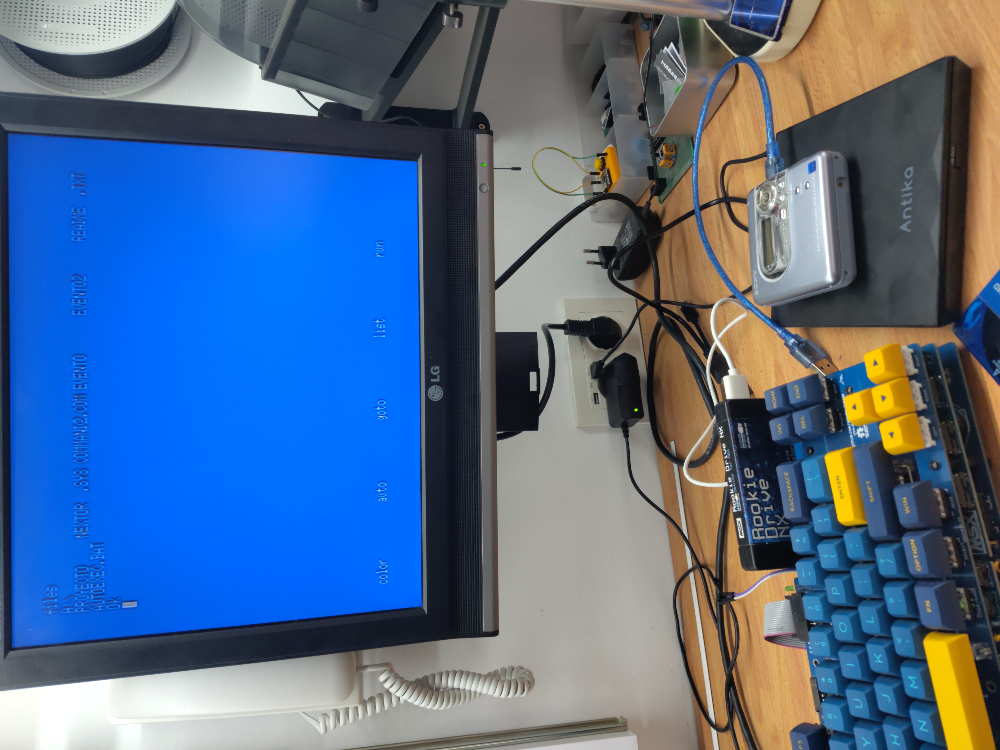

# Hi-MD Dream Drive

**A Nextor driver to use optical drives on an MSX: Hi-MD MiniDisc, CD or DVD.**

Hi-MD Dream Drive is a firmware for the **Rookie Drive NX** USB cartridge (CH376 chip) that lets an MSX read, write and **boot** from Hi-MD MiniDisc players (the ones with a USB connector), CD or DVD drives connected over USB. It has three parts: a Nextor driver, its own boot loader, and a recovery tool inside the ROM that updates the firmware from a USB stick.

The MiniDisc **is still a normal Sony disc**: the same disc is used in the walkman, on the Mac (or PC) and on the MSX, with nothing to convert.

**[IMPORTANT!!] Read the section about which cable to use to connect CD/DVD drives. Use the driver and the drives at your own risk.**

This project was made with the help of Claude Code.

*Versión en español: [README.es.md](README.es.md).*

<p align="center"></p>

*The test setup: an Omega MSX2+ with the Rookie Drive NX, the Sony MZ-NH600 Hi-MD walkman and the USB DVD drive. On screen, `FILES` listing a DVD.*

---

## What it does

- **Hi-MD MiniDisc as an MSX disk, shared with the walkman and the computer.** You format the disc in the walkman, copy files from the Mac or PC through the walkman, plug the walkman into the MSX, and the files are there. The MSX reads and writes the disc without breaking Sony's format: afterwards the walkman and the Mac still accept it.
  - Hi-MD uses 2048-byte sectors and Nextor expects 512-byte sectors. The driver does the translation.
  - The disc's boot sector (the one the walkman and the Mac need) is protected: the MSX never writes it, except when formatting.
- **CD and DVD over USB, read-only**, of two kinds:
  - **FAT discs** (burned on purpose with the same format as the MiniDisc).
  - **Normal ISO9660 discs** (the usual kind: any data CD, or a CD/DVD burned on a PC). The driver presents them to Nextor as a read-only FAT disk that it builds on the fly from the disc. Nothing needs to be prepared on the disc.
- **Booting MSX-DOS from the MiniDisc, the CD or the DVD**: if the disc has `NEXTOR.SYS` and `COMMAND2.COM`, the MSX boots into MSX-DOS from it; if not, it boots into BASIC.
- **`CALL DREAM` BASIC commands** (all of them are listed below): disc information, safe eject, walkman-compatible formatting and a diagnostic log.
- **Nextor's disk emulation mode (`EMUFILE`)**: games in floppy image form (`.DSK`) boot from the MiniDisc.
- **100% own, self-updating firmware**: boot loader and recovery written from scratch; to update, all you need is a USB stick and CTRL+R at power-on.

---

## Milestones

- **2026-07-08**: the MSX boots MSX-DOS from a MiniDisc. A historic date: as far as we know, it is the first time a computer boots its operating system from a MiniDisc.
- **2026-07-09**: speed multiplied by 4 (reading from 5.7 to 23.1 KB/s). Disc information, eject and format work. The walkman accepts a disc formatted by the MSX, hot disc changes, and unplugging and re-plugging the USB.
- **2026-09-22**: first DVD on the MSX: a DVD+R burned with FAT mounts and MSX-DOS boots from it.
- **2026-09-24**: first ISO9660 CD read (a PC CD, with nothing prepared) and MSX-DOS boots from an ISO9660 DVD burned on a Mac.
- **2026-09-25**: `EMUFILE`: a game in a floppy image boots from the MiniDisc.
- **2026-10-04**: driver v3.4.1, thoroughly validated and with many bugs fixed.

---

## Hardware

### What you need

- **An MSX2 or higher (tested on an MSX2+) with at least 128 KB of mapped RAM** (memory mapper). This is essential: the driver keeps its state and its cache in a 16 KB mapper segment, and without 128 KB of mapped RAM Nextor boots in MSX-DOS 1 mode, where the driver (and the Hi-MD's FAT16 discs) do not work.
- **A Rookie Drive NX cartridge** (USB with a CH376 chip at the MSX I/O ports 20h/21h). Other cartridges with a CH376 at the same ports should work, but they have not been tested.
- **A USB unit with 2048-byte sectors**: a Sony Hi-MD walkman (they all have a USB connector) or a USB CD/DVD drive. Careful: NetMD recorders that are not Hi-MD also have USB, but they are no use: they do not show up to the computer as a disk. **USB sticks and cards (512-byte sectors) are not used by this driver.**

### What has been tested

- MSX: **Sanyo PHC-70FD** (MSX2+), Omega MSX (MSX2+).
- Cartridge: **Rookie Drive NX**.
- Walkman: **Sony MZ-NH600** and **Sony MZ-RH1**, with **1 GB Hi-MD** discs and standard MiniDiscs formatted in Hi-MD mode (MD60 / MD74 / MD80). Other Hi-MD walkmans with USB should work.
- CD/DVD drive: **"Antika" slim USB** (Initio INIC-1618L USB bridge, **MATSHITA DVD-RAM UJ8B0** mechanism), powered separately and connected with a "data-only" cable (see the next section). Other normal USB "mass storage" drives should work the same, but they have not been tested.
- Optical discs tested: DVD+R burned with FAT, ISO9660 CD burned on a PC, ISO9660 DVD burned on a Mac.

---

## Powering the CD/DVD drive and the "data-only" cable

**This is important: a badly made cable can damage the MSX, the cartridge or the drive.**

**The Hi-MD walkman needs nothing**: plug it in with its normal USB cable and it works (it is powered over USB).

**A USB CD/DVD drive does.** It needs two things:

1. **Its own power.** The MSX cannot power it. A drive needs a lot of current, especially when it spins up the motor and focuses the disc, more than a normal USB port gives, and the Rookie Drive's USB port takes it from the MSX cartridge slot, which is not meant for that. Many slim drives come with a **second USB cable just for power**; that cable goes to a normal USB charger (we use a 1.2 A one).
2. **A "data-only" USB cable** between the Rookie Drive and the drive: a normal USB extension with **the red wire cut**.

### Why does the red wire have to be cut?

A USB cable has four wires: two for data (green and white), ground (black) and the +5 V supply (red, "VBUS").

When the drive is powered through its second cable from a charger, the charger's 5 V **come back** through the data cable towards the computer (this is called *back-feeding*): there are 5 V on the red wire of the data cable. On a PC nothing usually happens, but here that voltage goes into the cartridge and the MSX: two supplies pushing on the same wire. It can stress or damage the charger, the cartridge or the MSX, and the MSX can stay "half on" even when it is switched off.

That is why the "data-only" cable is mandatory with this kind of drive, and recommended with any drive (it has no downside for operation).

Cutting **only the red wire** keeps data and ground connected (ground is essential: it is the reference for the data signals) and keeps each side's power separate.

### Does my drive back-feed? A simple test

With the drive plugged into its charger and **not connected to the MSX**, measure with a multimeter the voltage between pin 1 (VBUS) and pin 4 (ground) of the USB plug that goes to the computer. If it reads about 5 V, the drive back-feeds and the "data-only" cable is mandatory. When in doubt, always use the "data-only" cable: it has no downside for operation.

### How to make the cable


*Our "data-only" cable, made from a broken USB cable and a [USB-A 2.0 female breakout board](https://es.aliexpress.com/item/1005006600039619.html) like the one in the middle of the photo (with the four pins labelled: VBUS, D-, D+, GND). Only three of the cable's wires are soldered to the board: D-, D+ and GND; the red one (VBUS) is left unconnected. The finished end is the one under the black heat-shrink.*

#### The simple way
1. A cheap USB extension (USB-A male to USB-A female).
2. Carefully strip a bit of the outer jacket, a few centimetres from one end.
3. Cut **only the red wire** and insulate both ends well (electrical tape or heat-shrink). Do not touch the others.
4. The colours are a standard, but not every manufacturer follows it: if in doubt, check with a multimeter that the wire you cut is the one for **pin 1** (VBUS) of the connector.
5. Label the cable "DATA ONLY" so it does not get used for anything else.

#### If you have a soldering iron
Another way to do it, with no extension to cut: a USB cable with its male plug (one broken at the other end will do) and a USB-A female breakout board of this kind. Solder D-, D+ and GND to the labelled pins and leave the red wire loose and insulated.

---

## Installation (flashing the firmware)

The file that goes into the cartridge is **`DDFIRMWA.ROM`** (192 KB). It has the boot loader and the recovery in bank 0, banks 1-3 free, and Nextor 2.1.4 with the driver in banks 4-11. Download the ready-built ROM from the repository's Releases section.

### The first time (from the cartridge's factory firmware)

The Rookie Drive's factory recovery looks for a file called **`RDFIRMWA.ROM`**, not `DDFIRMWA.ROM`. So, **only the first time**:

1. Copy the ROM to the root of a FAT USB stick **under the name `RDFIRMWA.ROM`**.
2. Plug the USB stick into the cartridge, power on the MSX holding **CTRL+R** and follow the on-screen instructions.

### From then on (with Hi-MD Dream Drive already in the Rookie Drive NX)

1. Copy `DDFIRMWA.ROM` (with that name) to the root of a FAT USB stick.
2. Plug the USB stick into the cartridge and power on the MSX holding **CTRL+R**.
3. The recovery looks for the file ("DDFIRMWA.ROM (192K) found and valid!"). **F1** = flash, **ESC** = cancel.
4. While it writes, it shows "DO NOT POWER OFF UNTIL DONE" and a row with the 12 banks: `.` pending, `o` in progress, `O` done, `X` error. **Do not power off until it says "DONE. Power off and on again."** Then power off and on.

The recovery writes Nextor first (banks 4-11) and the boot loader last, and it erases nothing without having first read from the USB stick what it is going to write. If reading the USB stick fails, it retries (up to 3 times, the whole file) and if it cannot, it says "USB read error. Retry, or try another pendrive.". If what fails is the cartridge's own memory chip, it says "Flash error. Power off and try again.".

### Keys at power-on

- **CTRL+R**: enter the recovery (update the firmware).
- **ESC**: skip the cartridge entirely (the MSX boots as if it were not there).
- Nothing else is needed with the USB stick: to use the MSX with the walkman or the drive, remove the USB stick and connect the unit.

---

## Usage

### Powering on

**Plug in the unit (walkman or drive) BEFORE powering on the MSX.**

At power-on you see "Hi-MD Dream Drive v.YYYYMMDD", "USB controller found!" and, below, the Nextor messages and "MD/CD/DVD USB Driver v.3.4.1". With a good disc you reach `A:\>` (if the disc has MSX-DOS) or BASIC.

- **The walkman can be switched off**: it turns on by itself with the USB power. If it takes a while to be ready, the bottom line shows `Waiting for the disc drive... (ESC to skip)` with a counter (`07/..` going down to `01/..`) and a small moving circle. The MSX boots by itself as soon as the disc is ready (a switched-off walkman takes less than half a minute). If the unit never gets ready, the MSX stops waiting by itself (about 3 minutes at most). With the walkman already on and the disc loaded, it boots right away.
- **ESC** during that line stops waiting and the MSX carries on booting (without the unit).
- **With nothing plugged in**, the MSX reaches BASIC in about 27 seconds (the wait line uses up its attempts), or at once with ESC.

### If the unit is plugged in after powering on

Nextor hands out drive letters at boot: if there is no unit, it gets no letter, and `FILES` says "Bad drive name" even though the disc is there. Two options:

- **Reset the MSX** with the unit already plugged in (the simplest), or
- without resetting: `CALL DREAM` (so the driver sees the unit; if it says `(no disc) [02/3A/00]` it is the walkman loading the disc: repeat `CALL DREAM` a few seconds later) and then **`CALL MAPDRV("A:",0,1,1)`**. With that, `FILES` lists the disc. The `0` (whole disc) is for discs formatted by the walkman or by `CALL DREAM FORMAT`; a disc with a partition table (FDISK) would use `1`.

### Changing discs

- You can change the disc (or the whole unit) with the MSX on. The first command after the change gives **"Disk offline" once** (in BASIC); the next one already sees the new disc. This is on purpose: that way nothing from the previous disc gets mixed with the new one.
- In MSX-DOS you get "Not ready": answer **A** (Abort) and repeat the command. ("Retry" repeats the "Not ready".) After an Abort the prompt may show as `A>` instead of `A:\>`: that is normal.
- While the walkman is loading a new MiniDisc (its icon spinning), `FILES` gives "Disk offline"; as soon as it stops, it lists the new disc.
- **Do not change MiniDiscs with a file open.** The safest way: `CALL DREAM EJECT` before taking the disc out.
- Unplugging the USB with the MSX on is also fine: each command gives "Disk offline" right away (no waiting), and when the unit is plugged back in, the next command uses it again.
- **Careful when plugging in a walkman with the MSX on: the MSX can reset.** When connected, the walkman suddenly pulls current from the USB (even more if it has a rechargeable battery and starts charging it), and that current comes from the MSX itself. It happened to us with an MZ-RH1 with its battery: plugged in hot, the MSX reset. Nothing gets damaged, but whatever was in memory is lost. The safe way is to plug in the unit before powering on.

### Formatting a MiniDisc

- **Recommended: format in the walkman** (from its menu). It is the format the walkman, the Mac and the MSX understand.
- **From the MSX: `CALL DREAM FORMAT`.** It asks "ALL DATA WILL BE LOST. FORMAT? (Y/N)"; with **Y** it writes the same format the walkman does ("Format complete."). Tested on the real machine with a MiniDisc and with a 1 GB Hi-MD: the walkman and the Mac accept it. When you put it in the walkman, it asks whether to create the audio file: that is expected (the MSX does not create the music part; the walkman creates it by itself).
- If the disc had no format (blank) when the MSX was powered on, Nextor gave it no letter: after formatting it, reset.
- **Do not use FDISK** on a MiniDisc: the disc becomes MSX-only (the walkman complains and the Mac does not see it).
- CD/DVDs cannot be formatted: "CD/DVD discs are read-only.".

### The `CALL DREAM` commands (= `CALL HIMD`)

`CALL DREAM` and `CALL HIMD` are the same thing (`HIMD` is the original name and stays forever).

- **`CALL DREAM`**: information. Example with the walkman:
  ```
  Hi-MD Dream Drive
  Unit:   SONY     Hi-MD WALKMAN
  Media:  964 MB  Hi-MD 1GB
  Format: FAT16 (Walkman compatible)
  Status: spinning
  Driver: v3.4.1
  ```
  With the drive: "Unit: MATSHITA DVD-RAM UJ8B0", "Media: 650 MB DVD+R", "Format: FAT16" or "Format: ISO9660 <disc label>". If some files on the CD cannot be shown, it adds "(partial)". With no unit: "(no device)"; with no disc: "(no disc) [kk/aa/qq]" (the reason given by the unit).
- **`CALL DREAM EJECT`**: safe eject. On the walkman it flushes caches and stops the disc ("Disc stopped. Safe to remove."). On a CD/DVD drive it opens the tray ("Disc ejected.").
- **`CALL DREAM FORMAT`**: format (see above).
- **`CALL DREAM LOG`**: shows the latest events the driver has seen (error codes from the unit, USB bring-ups...) and clears them. It is there for bug reports: a photo of the screen helps a lot.

### Diagnostic messages

If something fails, the driver writes a line on the last row of the screen (text mode only), for example `HIMD E:..`, `HIMD W:..` (write), `HIMD DS:..` or `HIMD INIT:..`. You do not need to understand it: **a photo of that line and of `CALL DREAM LOG`** is the best bug report.

### CD and DVD

- **Read-only**: `SAVE`, `COPY` to the disc, etc. give "Disk write protected".
- **ISO9660 discs**: names are shown in 8.3 format (8 letters + 3 for the extension, upper case). Names that do not fit are shortened with `~` and a number (for example `LONG_F~6.TEX`). Only the basic ISO names are read (Joliet and Rock Ridge are ignored).
- **To boot MSX-DOS from a CD/DVD**, `NEXTOR.SYS` and `COMMAND2.COM` have to be in the disc's root folder.
- A DVD burned on the Mac with `hdiutil` works as is. To burn an image: `hdiutil burn -speed 4 -forceclose <image>`.

### Disk emulation mode (`EMUFILE`)

Nextor's `EMUFILE.COM` (version 1.3 tested) works on a MiniDisc: you create the `.EMU` file with one or more `.DSK` images (`EMUFILE GAME.EMU GAME.DSK`) and `EMUFILE SET GAME.EMU` resets the MSX and boots the game from the MiniDisc. Tested on the real machine with the game Quinpl. Limits:

- **The `.DSK` has to be in one piece (not fragmented) on the disc.** EMUFILE says "Ok" even if it is fragmented, but the game will read data from somewhere else. A `.DSK` copied to a freshly formatted MiniDisc (or one where nothing has been deleted before) ends up in one piece.
- **Persistent mode (`EMUFILE SET x P`) is not possible on a walkman-formatted MiniDisc**: it would write to the disc's boot sector, which the driver protects ("Write protected disk"; nothing is written). On a disc with a partition table it does work, and holding **0** at power-on cancels it.
- **Does not work with CD/DVD.**

---

## Speed (measured on the real machine)

On the Sanyo PHC-70FD (Z80 at 3.58 MHz) with the MiniDisc:

| Operation | Speed |
|-----------|-------|
| Read | ~23.1 KB/s |
| Copy (read + write) | ~12.0 KB/s |

The limit is the MSX's CPU, not the MiniDisc.

---

## Known limits

- **Plugging in a walkman with the MSX on can reset the MSX** (the USB current surge comes from the MSX; seen with an MZ-RH1 with a rechargeable battery). Better to plug in the unit before powering on.
- **If at power-on there is no disc that can be read** (or ESC is pressed on the wait line), Nextor leaves no drive letter for it ("Bad drive name"). Solution: `CALL MAPDRV` (see "If the unit is plugged in after powering on") or reset with a good disc.
- **Scratched discs**: if the drive cannot use the disc (it cannot focus it), the driver says so right away ("Not ready", line `HIMD DS:04`) instead of waiting. Answer A (Abort) and change the disc. A read error in the middle of a file on a real disc has not been tested yet (the scratched discs we had would not even mount).
- **Two MiniDiscs formatted by the walkman are almost identical to MSX-DOS** (the walkman gives them all the same serial number). The walkman reports the disc change and the driver detects it, but the rule is: do not change discs with a file open.
- **UNDEL (recovering deleted files) does not work on a walkman-formatted MiniDisc.** When deleting, MSX-DOS wants to mark the disc in its boot sector, which the driver protects; the driver keeps that mark in its memory instead of on the disc. Consequences: (1) there is no UNDEL; (2) if you delete something and power off without writing anything else, the second copy of the disc's FAT can be left with the freed space still marked as used (the first copy, the one the walkman and the Mac use, is fine; it fixes itself with the next write in that area). The Mac's "First Aid" might warn that the two copies do not match.
- **ISO9660 CD/DVD**:
  - Only the first session of the disc. UDF-only discs (some DVDs burned on Windows) cannot be read.
  - Files larger than 2 GB, or that do not fit in the volume the driver builds on huge discs, are not shown (`CALL DREAM` adds "(partial)").
  - `DIR` in MSX-DOS works out the free space by reading the whole FAT: on an ISO DVD it takes a few seconds. BASIC's `FILES` is not affected.
  - Listing a folder with thousands of files is slow (about 2 and a half minutes for 3000 files in the emulator, almost all of it `FILES` drawing).
- **Nextor 3.0 is not compatible yet**: the driver is for Nextor 2.x (the ROM carries Nextor 2.1.4). Nextor 3 changes the way it talks to drivers; the driver will need to be adapted.
- **Only units with 2048-byte sectors** (Hi-MD walkmans and CD/DVD drives). Not USB sticks or cards.
- **CD/DVD drive just powered on (cold)**: its mechanism takes a moment to settle and the first long reads can fail with "no seek complete" (code 03/02/00). Since v3.4.1 the driver retries by itself, up to 5 times with a one-second pause between attempts and without starting a new one once about 40 seconds have passed since the first: normally the first `DIR` takes a few seconds longer and comes out fine. If the disc really cannot be read, the error ("Data error") still comes out, within that limit. These retries are checked in the emulator (with a copy of the same DVD that was failing); on the real machine they have not been seen in action yet. If the error still shows up, just repeat the command.

---

## How to report a bug

If something does not work, tell us: it is the only way to fix it. Bugs go in the **[Issues](https://github.com/peruho/msx-hi-md-dream-drive/issues)** section of the repository on GitHub. You can write in Spanish or in English.

Before writing, have a look at the "Known limits" section: what is happening to you may already be explained there.

### The most important thing: two photos

You do not need to understand anything on the screen. A phone is enough:

1. **A photo of the screen at the moment of the failure**, the whole screen, with the text readable. Look at the last row: if the driver has written a line starting with `HIMD` (for example `HIMD E:FA S:03/02/00 C:14 D:00`), it has to be in the photo.
2. **A photo of `CALL DREAM LOG`**. It is the record of the last things that happened to the driver. To see it:
   - **Do not power off or reset the MSX** after the failure: the log is lost.
   - If you are in MSX-DOS (`A:\>`), type `BASIC` to go to BASIC.
   - Type `CALL DREAM LOG` and take the photo. **You only get one chance**: the log is cleared when it is shown. If it says `(log empty)`, say so too.

If you can, add a third one: **a photo of `CALL DREAM`** (it says which unit and which disc the driver sees, and the version).

If the MSX hangs and you cannot type anything, take the photo of the screen as it is and say that it hung.

### What to tell

- **Version**: the one shown at power-on ("MD/CD/DVD USB Driver v.X.X") or in `CALL DREAM` ("Driver: vX.X").
- **Your machine**: MSX model, how much memory it has and which other cartridges are plugged in.
- **The unit**: which walkman or which CD/DVD drive (brand and model). If it is a drive: how you power it and whether you use the "data-only" cable.
- **The disc**: what it is (1 GB Hi-MD, standard MiniDisc, CD, DVD) and how it was prepared (formatted in the walkman, with `CALL DREAM FORMAT`, burned on a PC or a Mac and with which program).
- **The steps, one by one**, from power-on: what was plugged in, what you typed and in what order. Ideally someone else can repeat it by reading your list.
- **What you expected and what happened**, with the error message exactly as it appears on screen.
- **Whether it happens always or only sometimes**, and whether anything changes with another disc, with the unit just powered on (cold) or already running, or when repeating the command.

### An example

> **Title:** The first DIR of a DVD gives an error with the drive just powered on
>
> **Version:** v3.4. **MSX:** Sanyo PHC-70FD, 256 KB, no other cartridges. **Unit:** slim USB DVD drive (MATSHITA UJ8B0), with its charger and the "data-only" cable. **Disc:** DVD+R burned on a Mac with FAT format.
>
> **Steps:** 1) Drive switched off for a good while. 2) I power on the MSX with the DVD inside: MSX-DOS boots fine. 3) I type `DIR` as soon as `A:\>` appears.
>
> **What happens:** `DIR` lists the files but takes a long time, does not show the free space, and at the bottom there is `HIMD E:FA S:03/02/00 C:14 D:00`. I expected the normal listing with the free space.
>
> **Always?** Only with the drive cold. If I repeat `DIR`, it comes out fine.
>
> **Photos:** the screen with the error and `CALL DREAM LOG` (`R INIT / U START ok x2 / B HALT ok / F 03/02/00 / B HALT ok / F 03/02/00`).

(It is a real bug: with that report the cause was found and it was fixed in v3.4.1.)

### If you think a disc has been damaged

Do not keep writing to it from the MSX. First make a copy of whatever is on it from the computer (with the walkman connected to the PC or the Mac) and say so in the report: what was being done when it happened and what you see on the disc now.

---

## Building from source

You need:

- The **Nestor80** assembler (`N80`): download the version for your system from https://github.com/Konamiman/Nestor80/releases and put it in `toolchain/`.
- `curl` and a C compiler (for `tools/fetch-nextor.sh`), plus `python3` and `make`.

```sh
tools/fetch-nextor.sh   # downloads the Nextor 2.1.4 kernel and builds mknexrom
make own                # -> build/DDFIRMWA.ROM (the firmware you flash)
make rom                # -> build/NEXTOR-HIMD.ROM (Nextor + driver, without
                        #    boot loader or recovery; for emulators)
```

The build date goes inside the boot message, so two builds of the same sources made on the same day give exactly the same ROM.

### Tests

Before each version the driver is validated with a set of automated tests on a modified openMSX that emulates the CH376 chip (with the walkman and the CD/DVD drive). The intention is to publish that emulation separately later on.

---

## License and credits

Hi-MD Dream Drive is **GPLv3** (see `LICENSE`). The USB/CH376 part derives from the **MSX-USB** driver by **S0urceror** (Mario Smit), which is GPLv3; that is why the whole project is.

- **Nextor** and the **Nestor80** and **mknexrom** tools: **Konamiman** (Nestor Soriano). The ROM carries the unmodified Nextor 2.1.4 kernel; it is not included in the repository: `tools/fetch-nextor.sh` downloads it.
- **MSX-USB**: S0urceror. CH376 code used as the base.
- **RookieDrive-FDD-ROM**: Konamiman. That is where the original CH376 code that MSX-USB is based on comes from, and it has also been used as a reference.
- **Rookie Drive NX**: the cartridge by **Xavi Rompe** (rookiedrive.com). Without it, this project would not exist.
- Full third-party notices in `THIRD-PARTY-NOTICES.md`.

Made by **PERUHO** ([@peruho](https://x.com/peruho) on X) using Claude Code, 2026.
